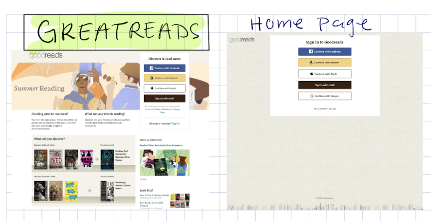
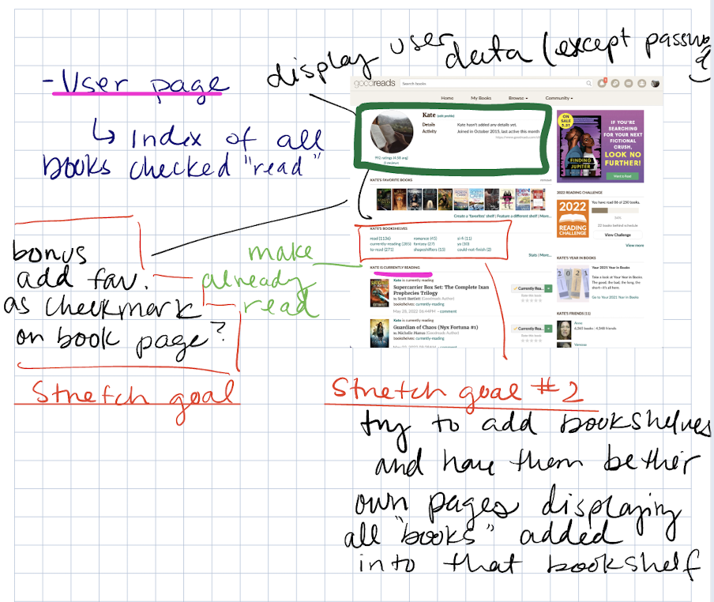
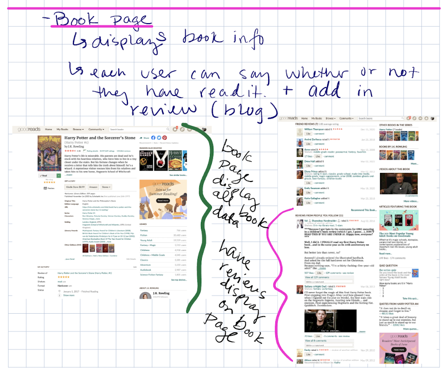
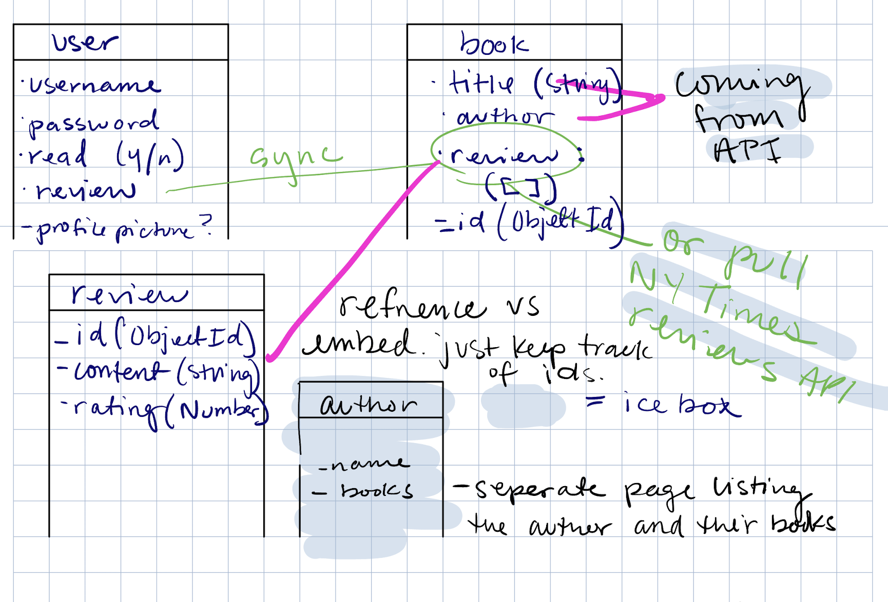
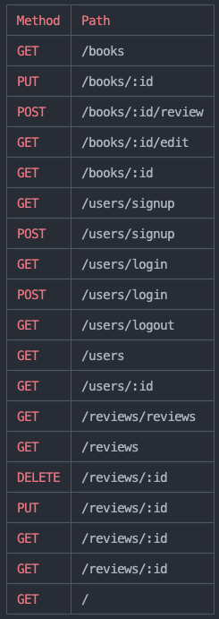

# GreatReads

## Premise: 

This project is modeled after GoodReads, a blog site that allows users to review books that they have read and add them to their own digital bookshelf.

## User Story:

- Users should be able to create their own profiles where they can add books to their bookshelves and review them.
- Users should also be able to view the individual book pages to read reviews and ratings.

## Wireframes:
 

Concept idea for the login/welcome page.

Concept idea for the login/welcome page.

Concept idea for the login/welcome page.

## The ERD: 

My proposed ERD for the project *(entity relationship diagram)*

## Route Table:
  <br\>
List of the routes I used.

## Technologies Used:
- JavaScript
- Css
- Mongodb
- Node.js
- Express

## MVP Requirements:
- Full CRUD *(Create, Read, Update, and Delete)* application
- User, Books and Review pages fully built and functioning

## Stretch goals:
- [ ] Create Author pages to link with Books
- [ ] Use stars to to measure the rating instead of numbers
- [ ] Create user bookshelves on their profile pages
- [ ] Connect a book api 

## ReadMe Credits:
All book information, images and descriptions were sourced from [GoodReads.com](https://www.goodreads.com) (the real one). Special thanks to Mark Gerken and Jordan Freundlich for help with figuring out hte logic to reference the reviews. 